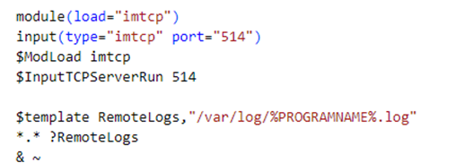
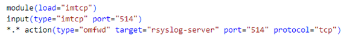

# Welcome

Just another lab for practice.

## Build 'n Run

- Build and run container
 `docker compose up -d --build`

## Configuration

- In the "rsyslog-server" container, open the /etc/rsyslog.conf file, add the following configuration at the end of the line.
  
- In the "db-server" container, open the /etc/rsyslog.conf file, add the following configuration at the end of the line.
  

## Connect to MySQL

- Access the client container using a web browser
`http://localhost:7681`
- Login to MySQL server
`mysql -uroot -p`

## Credentials

|                |USERNAME                       |PASSWORD					   |
|----------------|-------------------------------|-----------------------------|
|Terminal		 |`user				`            |Passw0rd           		   |
|MySQL			 |`root				`            |toor           			   |